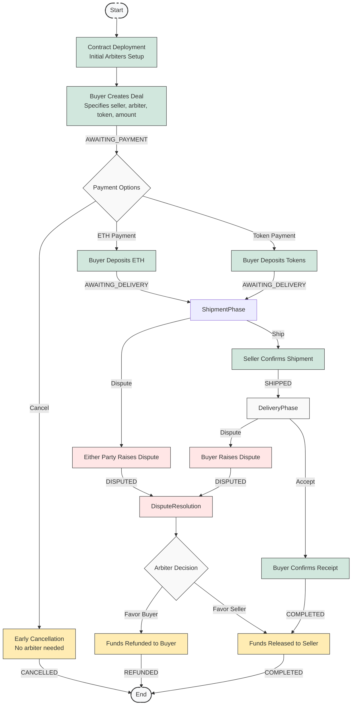

# NextEscrow

A blockchain-based escrow platform for secure transactions between parties.

## Deployed Contract

- Contract address: [0x5e3b94f2ea6ed8ea07c83abfac8e9b6d52efa511](https://sepolia.etherscan.io/address/0x5e3b94f2ea6ed8ea07c83abfac8e9b6d52efa511#code)
- [View Contract Code](https://sepolia.etherscan.io/address/0x5e3b94f2ea6ed8ea07c83abfac8e9b6d52efa511#code)
- [Read Contract](https://sepolia.etherscan.io/address/0x5e3b94f2ea6ed8ea07c83abfac8e9b6d52efa511#readContract)
- [Write Contract](https://sepolia.etherscan.io/address/0x5e3b94f2ea6ed8ea07c83abfac8e9b6d52efa511#writeContract)
- [Live Demo](https://nextrope-git-main-cleanerzkps-projects.vercel.app/)

## Test Arbiters

The following accounts are available for testing as arbiters. For testing purposes, these accounts have been pre-configured as arbiters in the contract deployment. **Note that these are publicly known accounts and should only be used for testing.**

```
Account #15: 0xcd3B766CCDd6AE721141F452C550Ca635964ce71 (10000 ETH)
Private Key: 0x8166f546bab6da521a8369cab06c5d2b9e46670292d85c875ee9ec20e84ffb61

Account #16: 0x2546BcD3c84621e976D8185a91A922aE77ECEc30 (10000 ETH)
Private Key: 0xea6c44ac03bff858b476bba40716402b03e41b8e97e276d1baec7c37d42484a0

Account #17: 0xbDA5747bFD65F08deb54cb465eB87D40e51B197E (10000 ETH)
Private Key: 0x689af8efa8c651a91ad287602527f3af2fe9f6501a7ac4b061667b5a93e037fd

Account #18: 0xdD2FD4581271e230360230F9337D5c0430Bf44C0 (10000 ETH)
Private Key: 0xde9be858da4a475276426320d5e9262ecfc3ba460bfac56360bfa6c4c28b4ee0

Account #19: 0x8626f6940E2eb28930eFb4CeF49B2d1F2C9C1199 (10000 ETH)
Private Key: 0xdf57089febbacf7ba0bc227dafbffa9fc08a93fdc68e1e42411a14efcf23656e
```

⚠️ **WARNING**: These accounts, and their private keys, are publicly known. Any funds sent to them on Mainnet or any other live network WILL BE LOST.

To use these accounts as arbiters in the escrow system, they must be signed in and have the arbiter role. In the testing environment, they are automatically granted this role.

## Test Task Implemented

This project implements a solution for the following test task:

```
Write a smart contract handling agreements between two users for selling physical items 
in exchange for ETH or any ERC-20 token. In case of disputes, the role of an arbiter 
resolving the dispute should be included.

Acceptance criteria:
1) Resistance to theft of funds from the contract
2) Dispute resolution by a third party
3) Support for any token in the ERC-20 standard

Technical criteria:
• Implementation in the Solidity language
• Automated tests with the ability to generate a coverage report
• Start-up documentation
```

## Project Structure

This monorepo contains:

- `web/`: Frontend application built with Next.js and shadcn/ui
- `chain/`: Smart contracts built with Solidity and Hardhat

## Escrow Process Flow

The diagram below shows the complete lifecycle of an escrow transaction:



## Getting Started

### Smart Contracts

```bash
cd chain
npm install
npx hardhat compile  # Compile the smart contracts
npx hardhat test     # Run the test suite with coverage report
npx hardhat deploy   # Deploy to the network specified in hardhat.config.js
```

### Web Application

```bash
cd web
npm install
npm run dev  # Start development server at http://localhost:3000
```

## Environment Variables

Copy the environment example files and fill in your own values:

```bash
cp web/.env.example web/.env.local
cp chain/.env.example chain/.env
```

### Required Environment Variables

#### Chain (.env)
```
PRIVATE_KEY=your_wallet_private_key
ETHERSCAN_API_KEY=your_etherscan_api_key
ALCHEMY_API_KEY=your_alchemy_api_key
```

#### Web (.env.local)
```
NEXT_PUBLIC_REOWN_PROJECT_ID=your_reown_project_id
ALCHEMY_API_KEY=your_alchemy_api_key
```

## License

MIT 
